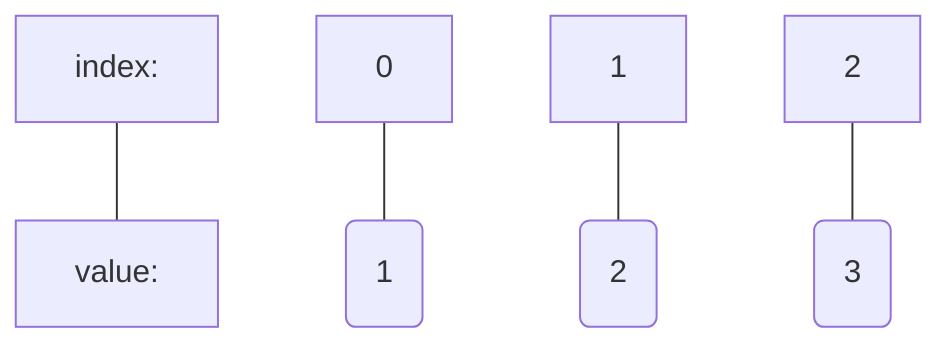
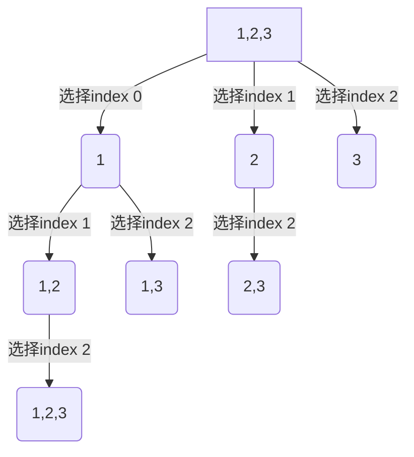

# 回溯
**解题思路**
- DFS（深度优先搜索）

```mermaid
graph TB
  A0[index:] --- value:
  A1[0] --- B1(1)
  A2[1] --- B2(2)
  A3[2] --- B3(3)
```
**回溯思路1：**

```mermaid
graph TB
    A[1,2,3] --> |选择index 0|A1(1)
    A --> |选择index 1|A2(2)
    A --> |选择index 2|A3(3)
    A1 --> |选择index 1|A11(1,2)
    A1 --> |选择index 2|A12(1,3)
    A2 --> |选择index 2|A22(2,3)
    A11 -->|选择index 2|A111(1,2,3)

```